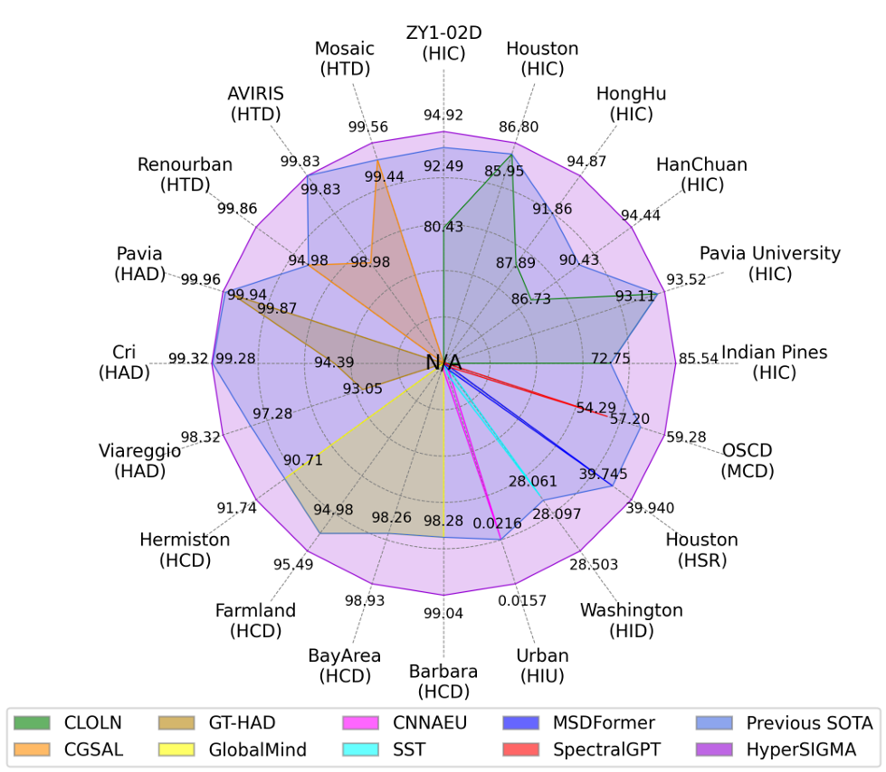
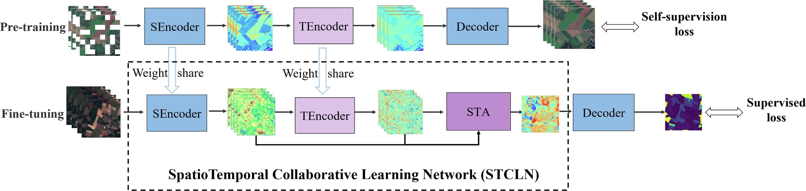
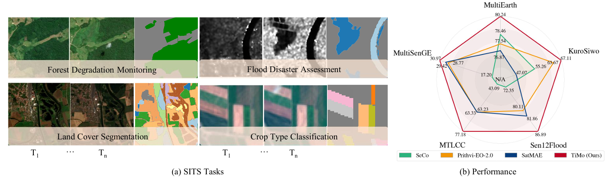
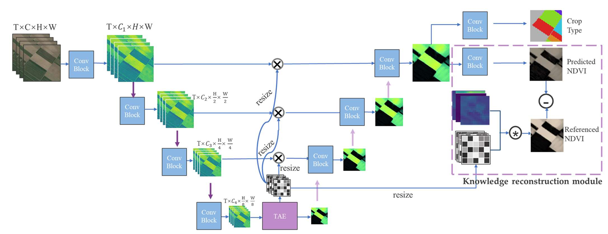
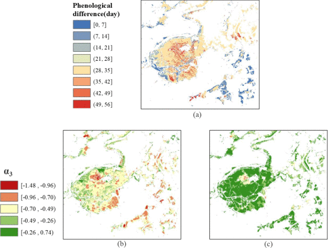








I am a Ph.D student at Wuhan University. Currently, I focus on:
- Foundation model on earth observation (EO) data
- Self-supervised learning
- Satellite image time series data

# 🔥 News
- *2025.04*: &nbsp; ✨ [*TiMo*](https://arxiv.org/pdf/2505.08723) is on ArXiv now (Spatiotemporal Foundation Model for Satellite Image Time Series).
- *2025.04*: &nbsp;🎉🎉 HyperSIGMA: Hyperspectral Intelligence Comprehension Foundation Model" is acceptted by <b>IEEE TPAMI</b> (<a href="https://ieeexplore.ieee.org/document/10949864" target="_blank">link</a>).
- *2025.03*: &nbsp;🎉🎉 One paper is accepted by <b>JAG</b> (<a href="https://www.sciencedirect.com/science/article/pii/S1569843225000731" target="_blank">link</a>). 
- *2025.03*: &nbsp; ✨ One paper is accepted for oral presentation at IGARSS 2025.

# 📝 Publications 
Note: * Equal contribution, ^ Corresponding authors.

TPAMI 2025

- [HyperSIGMA: Hyperspectral Intelligence Comprehension Foundation Model](https://ieeexplore.ieee.org/document/10949864)

Di Wang*, Meiqi Hu*, Yao Jin*, Yuchun Miao*, Jiaqi Yang*, Yichu Xu*, **Xiaolei Qin***, Jiaqi Ma*, Lingyu Sun*, Chenxing Li*, Chuan Fu, Hongruixuan Chen, Chengxi Han^, Naoto Yokoya, Jing Zhang^, Minqiang Xu, Lin Liu, Lefei Zhang, Chen Wu^, Bo Du^, Dacheng Tao, Liangpei Zhang^

[[**Code**](https://github.com/WHU-Sigma/HyperSIGMA)]  [[**Project**](https://whu-sigma.github.io/HyperSIGMA/)]

JAG 2025

- [Spatiotemporal masked pre-training for advancing crop mapping on satellite image time series with limited labels](https://www.sciencedirect.com/science/article/pii/S1569843225000731)

**Xiaolei Qin**, Haonan Guo, Xin Su^, Zhenghui Zhao, Di Wang, Liangpei Zhang

[[**Code**](https://github.com/XiaoleiQinn/STCLN)]

Arxiv 2025

- [TiMo: Spatiotemporal Foundation Model for Satellite Image Time Series](https://arxiv.org/pdf/2505.08723)

**Xiaolei Qin***, Di Wang*, Jing Zhang^, Fengxiang Wang, Xin Su, Bo Du, Liangpei Zhang

[[**Code**](https://github.com/MiliLab/TiMo)]

IGARSS 2024

- [Knowledge-Guided Satellite Image Time Series Classification Network for Crop Mapping](https://ieeexplore.ieee.org/abstract/document/10640757)

**Xiaolei Qin**, Xin Su^, Liangpei Zhang

JSTARS 2022

- [Inundation Impact on Croplands of 2020 Flood Event in Three Provinces of China](https://ieeexplore.ieee.org/abstract/document/9745760)

**Xiaolei Qin***, Qian Shi, Dongzhi Wang, Xin Su

# 🎖 Honors and Awards
- *2024.10* Outstanding postgraduate, Wuhan University. 
- *2022.10* Outstanding postgraduate, Wuhan University.
- *2024.01* Vice chair of IEEE GRSS Wuhan Student Branch Chapter
- *2025.07* Chair of IEEE GRSS Wuhan Student Branch Chapter
- 
# 📖 Educations
- *2021.09 - (now)*, Ph.D. Program in Photogrammetry and Remote Sensing in Wuhan University.
- *2017.08 - 2021.06*, B.E. of Geographical Information Science in Sun Yat-sen University. 
