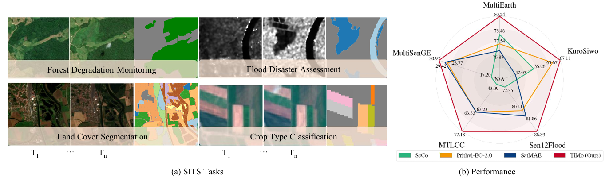
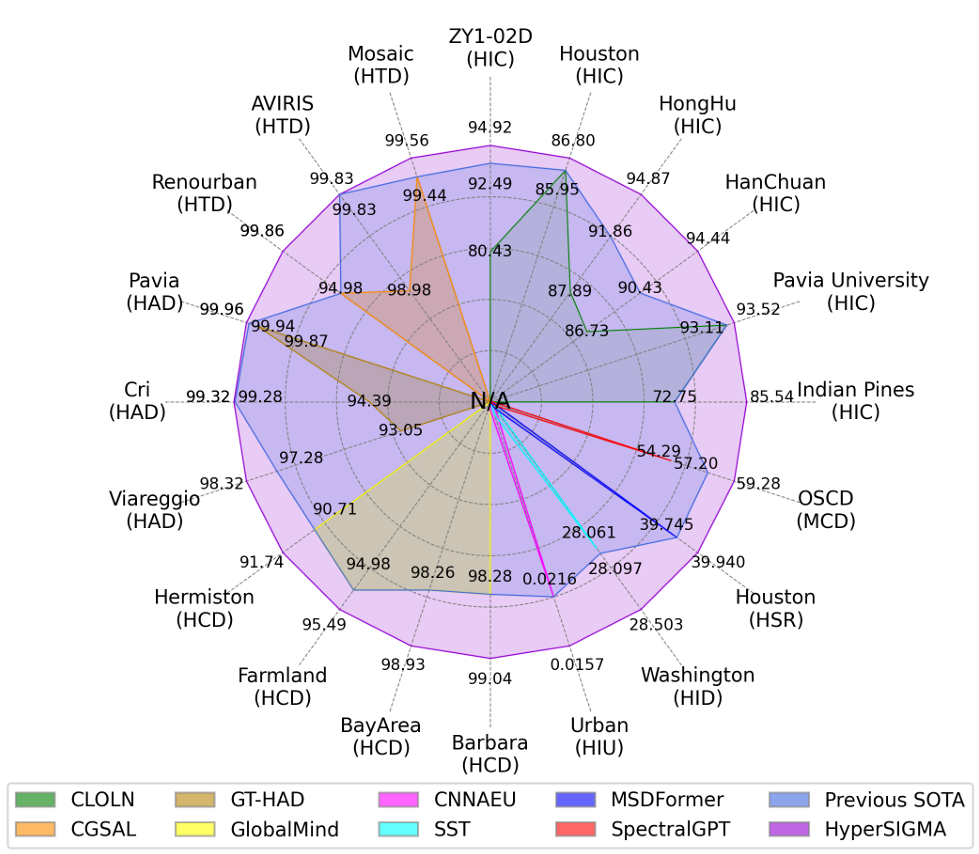
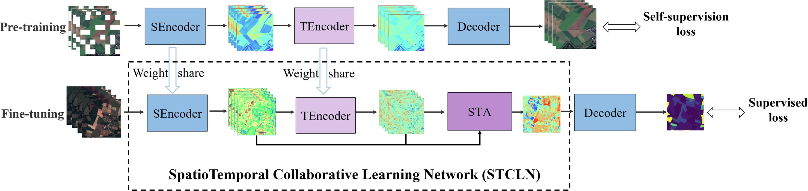
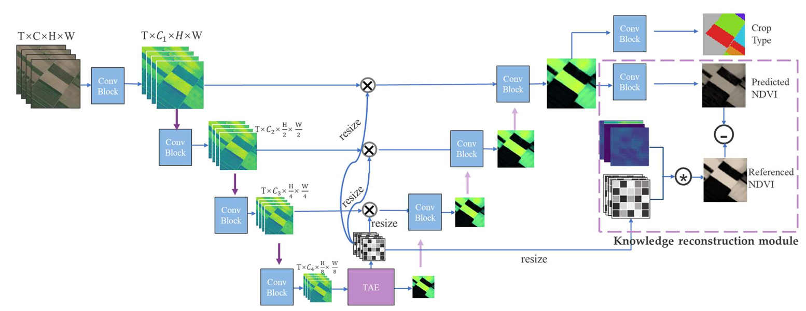
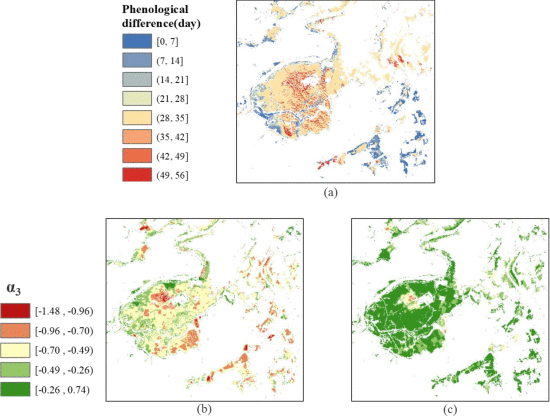








I received my Ph.D. in Photogrammetry and Remote Sensing from the [*State Key Laboratory of Information Engineering in Surveying, Mapping and Remote Sensing*](https://liesmars.whu.edu.cn/), Wuhan University, in June 2026. My research focuses on self-supervised learning and foundation models for satellite image time series (SITS), multi-source Earth observation, and multimodal remote sensing.

My current research interests include:
- Self-supervised pre-training and foundation models for satellite image time series
- Spatiotemporal representation learning, cross-region generalization, and data-efficient adaptation
- Multi-source optical/SAR Earth observation fusion, especially Sentinel-1/2 data
- Vision-language and reasoning models for geospatial scene understanding and decision support

# News
- *2026.03*: &nbsp; [SPEX](https://doi.org/10.1109/TGRS.2026.3670308), a vision-language model for land-cover extraction on spectral remote sensing images, was published in <b>IEEE TGRS</b>.
- *2025.11*: &nbsp; [GeoZero](https://arxiv.org/abs/2511.22645), a multimodal framework for geospatial scene reasoning, was released on arXiv.
- *2025.11*: &nbsp; I received the First Prize of the China Remote Sensing Outstanding Achievement Award.
- *2025.05*: &nbsp; [TiMo](https://arxiv.org/pdf/2505.08723), a spatiotemporal foundation model for satellite image time series, was accepted by <b>SCIS</b>.
- *2025.04*: &nbsp; [HyperSIGMA](https://ieeexplore.ieee.org/document/10949864) was published in <b>IEEE TPAMI</b>.
- *2025.03*: &nbsp; My first-author paper on spatiotemporal masked pre-training for crop mapping was published in <b>JAG</b> (<a href="https://www.sciencedirect.com/science/article/pii/S1569843225000731" target="_blank">link</a>).
- *2025.03*: &nbsp; One paper was accepted for oral presentation at IGARSS 2025.

# Publications
Note: \* Equal contribution; ^ Corresponding authors.

SCIS accepted

- [TiMo: Spatiotemporal Foundation Model for Satellite Image Time Series](https://arxiv.org/pdf/2505.08723)

**Xiaolei Qin**\*, Di Wang\*, Jing Zhang^, Fengxiang Wang, Xin Su, Bo Du, Liangpei Zhang

[[**Code**](https://github.com/MiliLab/TiMo)]

TPAMI 2025

- [HyperSIGMA: Hyperspectral Intelligence Comprehension Foundation Model](https://ieeexplore.ieee.org/document/10949864)

Di Wang\*, Meiqi Hu\*, Yao Jin\*, Yuchun Miao\*, Jiaqi Yang\*, Yichu Xu\*, **Xiaolei Qin**\*, Jiaqi Ma\*, Lingyu Sun\*, Chenxing Li\*, Chuan Fu, Hongruixuan Chen, Chengxi Han^, Naoto Yokoya, Jing Zhang^, Minqiang Xu, Lin Liu, Lefei Zhang, Chen Wu^, Bo Du^, Dacheng Tao, Liangpei Zhang^

[[**Code**](https://github.com/WHU-Sigma/HyperSIGMA)]  [[**Project**](https://whu-sigma.github.io/HyperSIGMA/)]

JAG 2025

- [Spatiotemporal masked pre-training for advancing crop mapping on satellite image time series with limited labels](https://www.sciencedirect.com/science/article/pii/S1569843225000731)

**Xiaolei Qin**, Haonan Guo, Xin Su^, Zhenghui Zhao, Di Wang, Liangpei Zhang

[[**Code**](https://github.com/XiaoleiQinn/STCLN)]

## Additional Selected Works
- [GeoZero: Incentivizing Reasoning from Scratch on Geospatial Scenes](https://arxiv.org/abs/2511.22645)  
  Di Wang, Shunyu Liu, Wentao Jiang, Fengxiang Wang, Yi Liu, **Xiaolei Qin**, Zhiming Luo, Chaoyang Zhou, Haonan Guo, Jing Zhang, Bo Du, Dacheng Tao, Liangpei Zhang

- [SPEX: A Vision-Language Model for Land Cover Extraction on Spectral Remote Sensing Images](https://doi.org/10.1109/TGRS.2026.3670308)  
  Dongchen Si, Di Wang, Erzhong Gao, **Xiaolei Qin**, Liu Zhao, Jing Zhang, Minqiang Xu^, Jianbo Zhan^, Jianshe Wang, Lin Liu, Bo Du, Liangpei Zhang

- [SITSMAMBA for Crop Classification Based on Satellite Image Time Series](https://doi.org/10.1109/IGARSS55030.2025.11243832)  
  **Xiaolei Qin**, Xin Su^, Liangpei Zhang

IGARSS 2024

- [Knowledge-Guided Satellite Image Time Series Classification Network for Crop Mapping](https://ieeexplore.ieee.org/abstract/document/10640757)

**Xiaolei Qin**, Xin Su^, Liangpei Zhang

JSTARS 2022

- [Inundation Impact on Croplands of 2020 Flood Event in Three Provinces of China](https://ieeexplore.ieee.org/abstract/document/9745760)

**Xiaolei Qin**, Qian Shi^, Dongzhi Wang, Xin Su

# Services
- *2025.07-Present* Chair, IEEE GRSS Wuhan Student Branch Chapter
- *2025.05-Present* Member, IEEE GRSS Content & Design Team [[*News*]](https://www.linkedin.com/posts/behind-every-igarss-live-stream-viral-share-7359818282834563072-JRnG/)
- *2024.06-2025.06* Vice Chair, IEEE GRSS Wuhan Student Branch Chapter
- *2023.07-Present* Editorial Intern, Geo-spatial Information Science
- Reviewer for IEEE TGRS, IEEE JSTARS, ICML, IEEE GRSL, and Scientific Data

# Honors and Awards
- *2025.11* First Prize, China Remote Sensing Outstanding Achievement Award, awarded by the Chinese National Committee for Remote Sensing.
- *2024.10* Second-Class Academic Excellence Scholarship, Wuhan University.
- *2022.10* Second-Class Academic Excellence Scholarship, Wuhan University.

# Patent
- Normalized Difference Vegetation Index (NDVI) time-series data reconstruction method and system, CN116434050B.

# Education
- *2021.09-2026.06* Ph.D. in Photogrammetry and Remote Sensing, Wuhan University.
  - Advisors: Prof. [*Liangpei Zhang*](https://zhangliangpei.cn/), Prof. [*Xin Su*](https://scholar.google.com/citations?user=aSqNc38AAAAJ&hl=zh-CN), and Prof. [*Chen Wu*](https://jszy.whu.edu.cn/wuchen/en/index.htm).
- *2017.09-2021.06* B.S. in Geographical Information Science, Sun Yat-sen University.
